# CompositeQuery v2 Design

Status: implementation record pending focused validation

CompositeQuery v2 is a caller-side coordinator over the existing CNCF Job
engine. The caller owns the supplied scheduler and its lifecycle. The
coordinator owns only branch declarations, invocation-local result state,
cancellation registrations, and captured Job IDs.

```mermaid
flowchart LR
  Caller[Caller ExecutionContext] --> Gate[Preflight and nested-worker guard]
  Gate --> Coordinator[Caller-thread DAG coordinator]
  Coordinator --> Engine[Owning CNCF JobEngine]
  Engine --> Task[CompositeQueryV2BranchTask]
  Task --> Protocol[Strict in-process V2 protocol]
  Protocol --> Target[Target Subsystem query-only boundary]
  Target --> Result[Ordered ephemeral aggregate]
```

The coordinator uses a single monitor for logical branch status and admission
reservations. It reserves before submit, limits actual running query bodies to
the policy ceiling, and waits with bounded `wait/notify` intervals on the
caller thread. Query dispatch, scheduler calls, cancellation callbacks,
response serialization, and Job control happen outside that monitor. A timed
out or cancelled running task keeps its physical reservation until the query
body exits, preventing over-admission while a non-cooperative provider still
uses a worker. Canonical settlement remains logically distinct, so a refused
or absent durable callback cannot publish a staged value or free the
reservation before canonical settlement or logical terminal state plus body
exit. Request expiry seals incomplete branches without choosing a fallback;
only branch-local timeout can select an explicitly eligible fallback.

`CompositeQueryV2BranchTask` is the JobEngine adapter. Its Job result is
`Void` or a fixed sanitized outcome. The query response stays in the
invocation-local callback channel and is published only from the Job task's
canonical outcome or admission-failure hook. A late callback cannot replace a
sealed branch result.

The protocol directory is immutable and holds only registered in-process
`Subsystem` references. `Local` resolves to the owning subsystem. A named
target cannot be an implicit URL, path, global runtime, or request credential.
The target executes through `executeQueryOnlyWithMetadata`, so its existing
selector resolution, operation authorization, and Query-only restriction remain
the authority.

Branch context construction starts from a fresh target component context. It
uses the target runtime, scope, resources, resource trees, UnitOfWork lineage,
and fresh response cell while retaining the caller's identity and correlation.
It resets operation evaluation and disables calltree/inline/save/trace-job
flags. This is deliberately implemented in the composite package through the
existing package-visible context copy primitives; `ExecutionContext`,
`RuntimeContext`, `UnitOfWork`, `ComponentLogic`, and `Subsystem` retain their
existing responsibilities.

Persistent diagnostics remain within the existing Job lifecycle. Their task
input and parameters are empty, their summary is fixed, and the branch task
does not return the query response. The design does not add a persistence
provider, custom store, transport, or scheduler.

The submitted Job envelope retains the caller's existing security, owner
resources, configuration, and scheduler context. It transforms only the
operation-evaluation buffer, response cell, and calltree flags required for
diagnostics-only composition. Target branch construction then preserves the
full caller security/trace while replacing runtime, scope, resources, and
UnitOfWork with the target component template.

Affected v1 consumers are the existing CompositeQuery engine and the StaticWeb
page context provider. They retain their original shape because V2 is exposed
only by the additive facade. The independent Job, context, authorization, and
page consumer specifications are the focused compatibility boundary.
