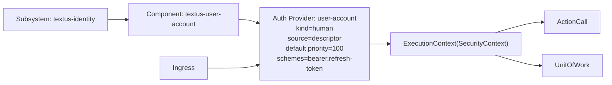

# ExecutionContext SecurityContext Session Integration Note

Date: 2026-04-09

## Purpose

Define the CNCF-side common integration point for authentication/session data carried through `ExecutionContext(SecurityContext)`.

This note distinguishes:

- common framework responsibility;
- human-subject authentication responsibility;
- subsystem/service-subject authentication responsibility.

## Direction

CNCF should standardize the shape and transport of authenticated session information.

The common path is:

1. receive credentials/assertions from REST or gRPC transport;
2. validate them through a subject-specific resolver;
3. normalize the result into shared `SecurityContext` / `ExecutionContext` data;
4. run authorization and observability using that shared context at the two chokepoints:
   - `ActionCall` execution;
   - `UnitOfWork` execution.

## Subject Categories

The common `SecurityContext` must not be human-user-only.

It should be able to represent at least:

- human subject;
- subsystem subject;
- service subject.

A shared model should therefore carry conceptually equivalent fields such as:

- subject kind;
- subject id / principal id;
- session id;
- token id or credential id;
- issuer;
- audience;
- authenticated time;
- expiration time;
- capabilities / roles / privileges;
- additional attributes.

## Responsibility Split

### CNCF

CNCF owns the common mechanism:

- transport-to-authentication handoff;
- session/credential resolver framework;
- normalized `SecurityContext` construction;
- propagation through `ExecutionContext`;
- use at authorization/observability chokepoints.

### textus-user-account

`textus-user-account` is the human-subject provider.

It should provide:

- `UserAccount` / `Credential` / `AccessSession` / `RefreshSession`;
- user authentication and session issuance;
- resolution of human-subject session information into the shared CNCF `SecurityContext` model.

It should not become the home of subsystem-to-subsystem authentication.

### system-subject provider

Subsystem/service authentication should be implemented as a separate provider/component.

Typical objects there may include:

- service account;
- client credential;
- system access session;
- key or assertion material.

## Current Scope

The current implementation target is limited to:

- shared CNCF `SecurityContext` semantics;
- integration of `textus-user-account` with that shared context;
- carrying human-session information through `ExecutionContext`.

This phase does not require full subsystem/service authentication implementation yet.

## Immediate Implication

Near-term design and implementation should focus on:

- making `SecurityContext` explicitly suitable for multiple subject kinds;
- ensuring `ExecutionContext` can carry authenticated session metadata regardless of subject kind;
- wiring `textus-user-account` user-session resolution into that common path.

## Descriptor Direction

The framework direction is descriptor-first with convention fallback.

This means:

- if a base security component is deployed, its authentication provider should be auto-wired by convention;
- subsystem descriptors should be able to disable that provider, reprioritize it, or choose among multiple providers;
- the resolved wiring model should later be projected into deployment diagrams and deployment specification documents.

For authentication wiring, the subsystem descriptor should carry a `security.authentication` section with at least:

- convention on/off;
- fallback privilege on/off;
- explicit provider list;
- provider priority/default selection;
- subject kind / scheme metadata.

## Minimal Deployment Diagram Shape

The first deployment diagram generated from subsystem descriptors should stay minimal and operational.

For security wiring, the minimum visible nodes are:

- subsystem
- deployed components
- authentication providers
- ingress boundary
- shared `ExecutionContext(SecurityContext)`
- authorization / observability chokepoints
  - `ActionCall`
  - `UnitOfWork`

The minimum visible edges are:

1. ingress -> authentication provider
2. authentication provider -> `ExecutionContext(SecurityContext)`
3. `ExecutionContext(SecurityContext)` -> `ActionCall`
4. `ExecutionContext(SecurityContext)` -> `UnitOfWork`
5. component -> authentication provider
6. subsystem -> component

For `textus-identity` with `textus-user-account`, the first diagram can be read as:

- subsystem: `textus-identity`
- component: `textus-user-account`
- provider: `user-account` (`kind = human`)
- schemes: `bearer`, `refresh-token`
- fallback privilege: disabled

This is intentionally smaller than a full deployment architecture diagram.
The goal of the first projection is to make security wiring explicit and editable from the descriptor.

Example Mermaid output:

## Minimal Deployment Spec Fields

The first generated deployment specification should include at least:

- subsystem name/version
- component list
- provider list
- provider kind
- provider scheme list
- convention enabled/disabled
- fallback privilege enabled/disabled
- default provider
- priority
- chokepoints used by the framework

This gives operators a descriptor-derived document that is both human-readable and close to runtime truth.
