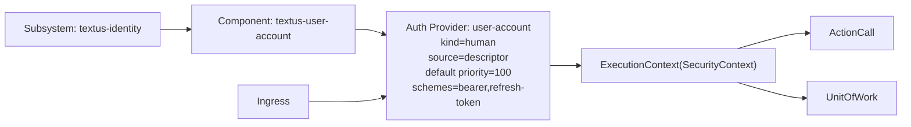

# Subsystem Descriptor Note

## Purpose

Subsystem descriptors are runtime metadata for subsystem composition. They are
not CML and should be parsed only through the unified descriptor parser.

## Role

A subsystem descriptor defines:

- subsystem identity
- participating component bindings
- runtime extension bindings
- optional config and wiring metadata

## Binding Precedence

Runtime binding should be resolved in this order:

1. subsystem descriptor
2. component descriptor
3. model-derived component default
4. factory built-in fallback

## Provisional YAML Shape

```yaml
subsystem: mcprag
version: 0.1.0-SNAPSHOT
components:
  - component: textus-mcp-rag
    coordinate: org.textus:textus-mcp-rag:0.1.0-SNAPSHOT
    extension_bindings:
      knowledge_source_adapters:
        - key: view
```

## Fields

- `subsystem`: subsystem name
- `version`: optional subsystem version
- `components`: component composition entries
- `components[*].component`: component artifact name
- `components[*].coordinate`: optional artifact coordinate
- `components[*].extension_bindings`: deployment-time extension binding values

## Extension Binding Example

```yaml
extension_bindings:
  knowledge_source_adapters:
    - key: view
```

This example means the subsystem composition selects only the `view` adapter for
that component.

## Current Boundary

The subsystem descriptor must not embed CML. Domain modeling belongs to CML,
while deployment-time composition belongs to descriptors.


## Journal Sample

- `/Users/asami/src/dev2025/cloud-native-component-framework/docs/journal/2026/04/2026-04-08-subsystem-descriptor-mcprag.yaml`
- `/Users/asami/src/dev2025/cloud-native-component-framework/docs/journal/2026/04/2026-04-09-subsystem-descriptor-textus-identity.yaml`


## Security Wiring Shape

Subsystem descriptors should be able to declare security wiring explicitly while still allowing convention-based auto wiring.

Provisional shape:

```yaml
subsystem: textus-identity
version: 0.1.0-SNAPSHOT
components:
  - component: textus-user-account
    coordinate: org.textus:textus-user-account:0.1.0-SNAPSHOT
security:
  authentication:
    convention: enabled
    fallback_privilege: enabled
    providers:
      - name: user-account
        component: textus-user-account
        kind: human
        enabled: true
        priority: 100
        schemes:
          - bearer
          - refresh-token
        default: true
```

### Security Fields

- `security`: subsystem-level security wiring section
- `security.authentication`: authentication/session wiring section
- `security.authentication.convention`: whether convention-based provider discovery is enabled
- `security.authentication.fallback_privilege`: whether legacy privilege fallback remains enabled when no provider resolves the request
- `security.authentication.providers`: explicit authentication provider entries
- `security.authentication.providers[*].name`: stable wiring name used in deployment specs and generated diagrams
- `security.authentication.providers[*].component`: component name hosting the provider
- `security.authentication.providers[*].kind`: provider subject kind such as `human`, `service`, or `subsystem`
- `security.authentication.providers[*].enabled`: explicit on/off switch
- `security.authentication.providers[*].priority`: precedence among multiple matching providers; higher wins
- `security.authentication.providers[*].schemes`: transport/auth schemes handled by the provider
- `security.authentication.providers[*].default`: whether the provider is the default candidate when multiple matches remain

### Resolution Order

Security provider resolution should be determined in this order:

1. descriptor-disabled providers are excluded
2. descriptor-explicit providers are considered first
3. if `convention: enabled`, convention-discovered providers are added
4. selector/default/priority chooses the winner among matches
5. if no provider resolves and `fallback_privilege: enabled`, legacy privilege resolution applies

### Convention Contract

Convention-based auto wiring means:

- a deployed component exposes one or more authentication providers;
- CNCF automatically discovers them from subsystem components;
- no manual per-component wiring is required for the default case.

Descriptor entries exist to override this default, for example to:

- disable a provider;
- choose one provider among several;
- assign explicit priority;
- document deployment intent in a descriptor-first form.

### Deployment Output Direction

The resolved security wiring model should become the source for:

- runtime provider selection;
- generated deployment diagrams;
- deployment specification documents edited by operators.

### Deployment Projection Example

The journal sample descriptor for `textus-identity` should now project to a minimal Mermaid deployment diagram like this:



This example is intentionally minimal:

- deployment naming follows descriptor-facing names such as `textus-user-account`
- provider metadata shows only operator-relevant fields
- the diagram stops at the common security/observability chokepoints

### Deployment Markdown Projection Example

The same descriptor should also project to an editable Markdown deployment specification draft like this:

````markdown
# Security Deployment Specification

## Subsystem

- name: `textus-identity`
- authentication convention: `enabled`
- fallback privilege: `disabled`

## Diagram


## Authentication Providers

| Name | Component | Kind | Source | Priority | Default | Schemes |
| --- | --- | --- | --- | ---: | --- | --- |
| user-account | textus-user-account | human | descriptor | 100 | true | bearer, refresh-token |

## Framework Chokepoints

- `ActionCall`
- `UnitOfWork`
````
